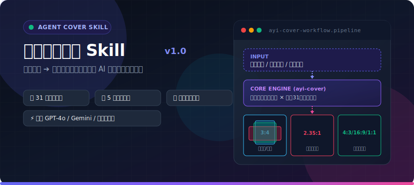
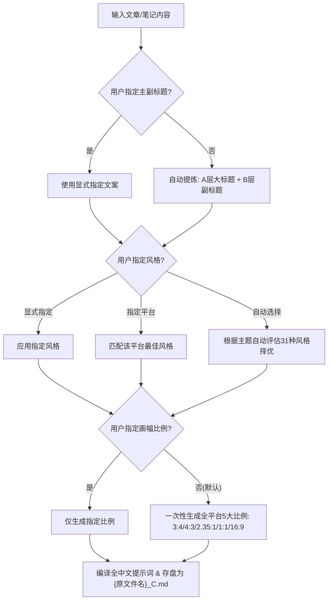

<div align="center">

<p align="center">
  
</p>

<br />

[](LICENSE)
[](#-31-种内置视觉风格画廊-style-gallery)
[](#-画幅尺寸与全平台映射)
[](#-提示词编译规范)

</div>


---

## 💡 什么是阿一封面制作 Skill？

**阿一封面制作 Skill** (`ayi-cover`) 是专门面向内容创作者、博主、公众号大V及知识库作者打造的**独立 Agent 封面提示词编译技能**。

只需将长短文章、笔记或主题草稿输入给 Agent，`ayi-cover` 就能自动萃取核心视觉隐喻、确定视觉基调，并匹配最契合的设计风格，一次性编译出包含 **小红书/抖音/公众号/B站** 等全平台主流画幅比例的标准化中文 AI 绘图提示词集合文档（`{原文件名}_C.md`）。

欢迎访问阿一AI站，获取更多AI教程和阿一原创Skill和插件。阿一AI站：[https://www.ayi001.xyz/](https://www.ayi001.xyz/)

---

## 🔥 核心痛点与解决方案

| 传统封面制作痛点 | ✨ `ayi-cover` 解决方案 |
| :--- | :--- |
| **画面与主题脱节**：构图随机，无法准确表达长文深层含义 | **自动视觉隐喻萃取**：智能提取深度象征物（如“交接棒”、“修车手册”、“数据报告大屏”） |
| **多平台尺寸繁琐**：不同平台需要重复设计，工作量翻倍 | **一次生成全尺寸延展**：默认一键输出 `3:4`、`4:3` 2.35:1`、`1:1`、`16:9` 5大比例提示词 |
| **视觉风格混乱**：系列文章或品牌封面风格无法统一 | **统一延展原则**：同批次所有尺寸保持配色、主体、排版、风格 100% 视觉连贯 |
| **提示词难调教**：中英混合混淆 AI 大模型，包含方位形容词导致画画失真 | **全中文自然语言编译**：优化适配 ChatGPT/GPT-4o、DALL-E 3、Gemini 及即梦 AI，独立比例尾注 |

---

## 🎨 31 种内置视觉风格画廊 (Style Gallery)

`ayi-cover` 内置了 **31 种独家精修视觉风格**，涵盖商业、科技、二次元、艺术、涂鸦、美漫、学术等全维度场景：

### 1. 商业 / 科技 / 咨询
> 适用于科技趋势、商业报告、工具教程、AI 工作流与高端干货

| 风格名称 | Style ID | 预设预览 | 最佳适用场景 |
| :--- | :--- | :--- | :--- |
| **咨询报告视觉** | `consulting-report-visual` |  | 商业策略、方法论、产品分析、结构化观点 |
| **商业杂志头版** | `business-magazine-front-page` |  | AI、创业、投资、趋势、商业科技封面 |
| **黑红剪影** | `black-red-silhouette` |  | 工具教程、AI 工作流、金融、速度、电影封面 |
| **苹果极简风格** | `apple-minimal-style` |  | 科技趋势、高级教程、产品发布、高端体验长文 |
| **品牌协同连接** | `brand-collaboration-connection` |  | 品牌联动、工具集成、自动化工作流、企业级连接 |
| **银色锡纸蓝字** | `silver-foil-blue-minimal` |  | 成长路径、方法论、商业系统、AI 工具高级极简 |
| **博主重磅课程风** | `creator-course-3d-highlight` |  | 知识付费、实战干货、重大决策建议、博主课程 |

---

### 2. 极简 / 概念 / 学术
> 适用于深度观察、学术科研、哲学思考与抽象思维表达

| 风格名称 | Style ID | 预设预览 | 最佳适用场景 |
| :--- | :--- | :--- | :--- |
| **黑白极简概念** | `black-white-minimal-concept` |  | 抽象观点、战略、哲学、批判性主题 |
| **语义转译极简** | `semantic-minimal-translation` |  | 单词、短句、口号、概念转译 |
| **科研期刊概念** | `research-journal-concept` |  | 科研、医学、材料、生物、机制类主题 |
| **极简公共空间摄影** | `minimal-public-space-photography` |  | 观点长文、文化观察、空间秩序、个体与组织关系 |
| **黑白灰先锋几何** | `black-white-gray-avant-geometry` |  | 实验性、现代主义、几何构成、强对比视觉 |
| **法式极简墨线海报** | `french-minimal-ink-poster` |  | AI、关系、制度、选择和抽象观点手绘墨线 |
| **黑红巨字压迫风** | `black-red-giant-text` |  | 认知误区纠正、深度批判长文、社会现象、思维反思 |

---

### 3. 复古 / 艺术 / 建筑
> 适用于文化杂志、设计灵感、品牌故事与强冲击视觉海报

| 风格名称 | Style ID | 预设预览 | 最佳适用场景 |
| :--- | :--- | :--- | :--- |
| **复古手撕拼贴** | `retro-torn-collage` |  | 社交传播、文化议题、街头感、复古杂志感 |
| **复古弥散渐变** | `retro-diffuse-gradient` |  | 艺术、设计、品牌、情绪化文章和杂志封面 |
| **先锋复古建筑海报** | `avant-retro-architecture-poster` |  | 建筑地标、城市海报、旅行封面、展览活动 |
| **复古油墨点阵隐喻** | `retro-ink-dot-matrix-metaphor` |  | AI、科技、系统、研究和抽象观点复古点阵隐喻 |
| **黑色复古现代主义封面** | `black-midcentury-modernist-cover` |  | 复古高级、服务场景、产品人物、概念封面 |
| **巨型透视中文标题** | `giant-perspective-chinese-title` |  | 中文标题主导、强冲击、活动和社媒封面 |
| **彩色新构成主义巨构海报**| `color-neo-constructivist-megastructure-poster` |  | 热点事件、体育赛事、产品发布、强冲击社媒 |

---

### 4. 动漫 / 美漫 / 游戏 / 系统
> 适用于博主爆款视频、二次元活动、游戏大促与赛博朋克科技

| 风格名称 | Style ID | 预设预览 | 最佳适用场景 |
| :--- | :--- | :--- | :--- |
| **方块世界** | `block-world` |  | 教程、工具、系统搭建、升级、游戏化表达 |
| **积木世界** | `brick-world` |  | 搭建、团队、计划、教育、亲子和系统隐喻 |
| **美漫爆发人物封面** | `comic-burst-creator-cover` |  | YouTube/B站视频封面、爆款热点、争议观点、个人 IP |
| **二次元 IP 活动大促风** | `anime-ip-promo-banner` |  | 游戏特惠、主机大促、周边发售、限时折扣文章 |
| **复古日本科幻动画** | `retro-japanese-sci-fi-anime-cover` |  | AI、代码、系统、心理、社会冲突和方法论 |

---

### 5. 手绘 / 涂鸦 / 亲切生活
> 适用于小红书爆款速成、高效笔记法、解压指南与日常干货

| 风格名称 | Style ID | 预设预览 | 最佳适用场景 |
| :--- | :--- | :--- | :--- |
| **黑底手绘便签风** | `hand-drawn-doodle-dark` |  | 工具分享、资源清单、省钱攻略、新手保姆级指南 |
| **萌系手绘综艺教程风** | `pop-variety-show-doodle` |  | 剪辑/Vlog教程、小红书速成指南、美妆生活干货 |
| **丑萌极简彩绘风** | `cozy-quirky-doodle` |  | 灵感大爆炸、AI 绘画日记、治愈随笔、小红书高赞创意 |
| **黑板粉笔手绘撕纸风** | `chalkboard-doodle-torn-paper` |  | 学习/提分攻略、备考复习、高效笔记法、教育科普 |
| **蓝黄波点波普风** | `blue-yellow-pop-dot` |  | Todolist 计划表、行动指南、告示提醒、强互动引导 |

---

## 🧠 智能决策逻辑 (Smart Decision System)

`ayi-cover` 在接收用户请求时，遵循严格的逻辑分层决策：




### 1. 主副标题提取原则
- **显式优先**：若包含 `主标题：xxx` 或 `副标题：yyy`，**无条件严格采用**。
- **自动抽取**：
  - **A层主标题**：高冲击力、短促极简（抓人眼球）。
  - **B层副标题**：完整补全文章核心价值。

### 2. 画幅尺寸与全平台映射

| 尺寸比例 | 典型适用平台与位置 |
| :---: | :--- |
| `3:4` | **小红书** 笔记封面、**抖音** 图文封面 |
| `2.35:1` | **微信公众号** 头条大图封面 |
| `4:3` | **微信公众号** 次条/三条封面、知乎文章封面 |
| `1:1` | **小红书** 方图、**朋友圈** 贴图、**B站** 动态图片 |
| `16:9` | **B站** 视频封面、**YouTube** 视频缩略图 |

---

## ⚡ 快速开始 (Quick Start)

### 安装为项目级 Skill

将 `ayi-cover` 安装到您 Agent 项目根目录下的 `.agents/skills/ayi-cover/` 目录中：

```bash
# 进入您的项目根目录
cd your-agent-project

# 创建项目级 skill 目录并放置 ayi-cover
mkdir -p .agents/skills/ayi-cover
```

确认目录结构如下：

```text
your-agent-project/
└── .agents/
    └── skills/
        └── ayi-cover/
            ├── SKILL.md                  # 核心技能定义
            ├── agents/                   # Agent 执行逻辑
            └── references/               # 31种风格索引与提示词蓝图
                ├── style-catalog.md
                └── prompt-blueprint.md
```

---

### 使用示例指令

您只需向配备了 `ayi-cover` Skill 的 Agent 发出如下指令：

#### 示例 1：全自动匹配（无需多余参数）
> **用户**：`帮我为文章 E:\Document\notes\article.md 制作一套封面提示词。`
> 
> **结果**：Agent 自动抽取文章标题与隐喻，自动挑选最契合风格，生成 `E:\Document\notes\article_C.md`，内含 3:4、4:3、2.35:1、1:1、16:9 五种尺寸提示词。

#### 示例 2：显式指定标题与指定风格
> **用户**：`为文章 article.md 制作封面。主标题：七月爆款文章分析报告，副标题：流量背后的唯一逻辑。指定风格：蓝黄波点波普风。`

---

## 📄 存盘与文件输出规范

生成结果将严格遵循同级存盘原则，命名为 `{原文件名}_C.md`。

输出文件的 Markdown 结构如下：

````markdown
# 封面设计方案说明

- **选用设计风格**：咨询报告视觉 (`consulting-report-visual`)
- **选用理由**：文章拆解 300 个爆款选题与流量背后的情绪需求匹配，报告风格极具专业质感。
- **核心视觉隐喻**：深藏青背景下的咨询报告数据分析视图。

---

## 尺寸：3:4 (适用于：小红书/抖音封面)

```text
请生成一张小红书封面图。采用咨询报告视觉风格。
【背景色调与材质】：深藏青色极简商务背景，带有细腻的几何网格线。
【文字排版】：画面上方为纯白粗体中文大标题“七月爆款文章分析报告”，下方搭配亮橙色字幕“流量背后的唯一逻辑”。
【视觉主体】：画面正中央为一个高亮度的咨询报告数据统计面板。
【画面细节与质感】：矢量数据图表、橙色高亮数据节点。
【禁止元素】：禁止出现杂乱插画、3D卡通形象。
整体画面呈现出严谨、高级的商业数据拆解质感。
画幅比例为3:4
```

## 尺寸：2.35:1 (适用于：微信公众号头条封面)

```text
请生成一张微信公众号头条封面图。采用咨询报告视觉风格。
【背景色调与材质】：深藏青色商务背景。
【文字排版】：左右分栏布局，左侧为白色大标题“七月爆款文章分析报告”，下方副标题“流量背后的唯一逻辑”。
【视觉主体】：右侧呈现极具专业度的咨询报告数据大屏。
画幅比例为2.35:1
```
````

---

## 📜 许可证

本项目基于 [MIT License](LICENSE) 开源发布。自由使用，欢迎提交 PR 扩充更多视觉风格！

---

## 🙏 致谢

本 Skill 参考了：[Punk Skill](https://github.com/adrianpunk/Punk-Skill)

